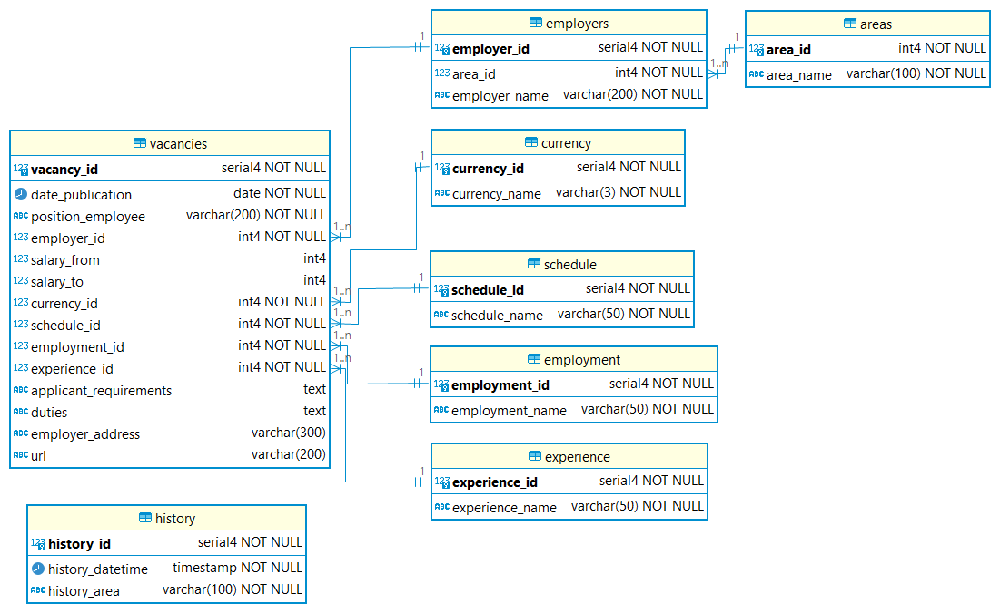

# Курсовая работа № 5
## «Проект по БД «Вакансии в России»
### Заберов Дмитрий, Python IND 27.0

## Технологии
Проект разработан на ЯП Python 3.11

## Использование
Программа, которая получает данные о компаниях и вакансиях с сайта hh.ru, создаёт БД, таблицы в PostgreSQL и загружает полученные данные в созданные таблицы и выводит информацию о вакансиях в терминал.

## Разработка
### Требования
Для запуска проекта, необходимо запустить код из файла src/main.py.

Константы находятся в файле src/conf/constants.py.
## Особенности
### Схема БД

### Описание
Проект содержит 3 директории:
* src\conf – содержит конфигурационные файлы (обязательно наличие файла database.ini, который не размещается на GitHub), файлы со скриптами SQL и файл с константами;
* src\logs – файл с логами работы программы, который очищается при каждом запуске программы. Необходимая, для работы программы, информация из логов хранится в таблице БД history;
* src\utils – скрипты, содержащие классы и утилиты программы.

Файл, запускающий программу: src\main.py.

При первом запуске программы создаётся БД vacancies и заполняется данные в соответствии с запросом пользователя о вакансиях в конкретном регионе/городе.

Если база данных уже существует и заполнена по конкретному региону/населённому пункту, то пользователь получает эту информацию и может при желании загрузить в БД данные по другому региону/населённому пункту или пользоваться теми данными, которые уже загружены в БД. 

Если пользователь выбирает другой регион/населённый пункт, то все данные из БД из таблиц очищаются (кроме таблицы history, которая хранит историю обращений) и заполняются новыми данными, обращаясь к API hh.ru.

Если вводимое название населённого пункта не уникально (таких населённых пунктов в настоящее время 1253), то при вводе населённого пункта название региона следует вводить в скобках, соблюдая правила набора (один пробел между словами, внутри скобок после открывающей скобки и перед закрывающей не следует вводить пробел). Например, «Аксай (Волгоградская область)», «Аксай (Дагестан)», «Аксай (Ростовская область)». Поэтому, если не удалось найти данные по одному ключевому слову, например, «Аксай», то нужно воспользоваться рекомендациями, указанными выше.

Для поиска данных по регионам России с доступных сервисов загружаются словари с актуальными данными при каждом запуске приложения. Словари с регионами хранятся в файлах в таблице БД areas. Указанная таблица служит источником данных при поиске id региона/населённого пункта при формировании запросов к сервису при поиске информации о вакансиях в конкретном регионе/населённом пункте.

С сервисов загружаются все возможные вакансии по региону/населённому пункту (не более 2000), полученные данные заносятся в соответствующие таблицы БД.

В результате работы программы пользователь может получить следующие данные:
* информацию о ТОП-10 компаний, сгруппированных по количеству предлагаемых вакансий;
* информацию о предлагаемой средней заработной плате по всем имеющимся вакансиям, вычисляемой как среднее значение средних зарплат «от» и «до»;
* подробную информацию о любом количестве имеющихся вакансий (по умолчанию выводится 10, если другое количество не указано пользователем);
* подробную информацию о любом количестве имеющихся вакансий с зарплатой выше среднего (по полям «salary_from» и «salary_to»), сортированных по убыванию заработной платы (по умолчанию выводится 10 вакансий, если другое количество не указано пользователем);
* подробную информацию о любом количестве вакансий, найденных по ключевому слову в БД (поиск ведётся по наименованию должности, предлагаемой работодателями).

Пользователь практически в любой момент может прервать выполнение программы, выбрав соответствующую команду из предложенного меню.

Для доступа к API сервиса hh.ru ключ не нужен.
### Установка зависимостей
Зависимости, необходимые для работы и тестирования проекта указаны в pyproject.toml.